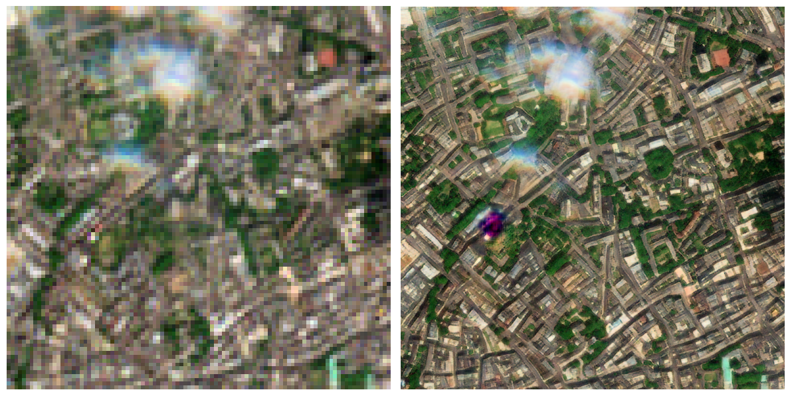

Gamma Earth have produced a neural-net based Super-Resolution upscaling estimation system trained on Sentinel-2 Imagery. This upscales from 10m to 1m data in 10 bands.

https://medium.com/@ya_71389/sentinel-2-deep-resolution-3-0-c71a601a2253

Google Colab Notebook

https://colab.research.google.com/drive/18phbwA1iYG5VDGN2WjK7WrWYi-FdCHJ5#scrollTo=DXlqhQonAAGk

Example code:

```
# Make sure to select T4 GPU instance from the Runtime/Change-runtime-type menu

!apt install -qq gdal-bin
!pip -q install https://storage.googleapis.com/0x7ff601307fa5/s2dr3-20250112.1-cp311-cp311-linux_x86_64.whl
import s2dr3.inferutils

# Specify the target location in the Lon,Lat (X,Y) format.
# The model will process a 4x4 km bounding box around the target location
lonlat = (-0.082393,51.511092) # NOTE THE X,Y FORMAT!

# Specify the target date. Please note, S2DR3 model will process the date
# from the Sentinel-2 catalogue that is closest to the specified date.
# Selected date may be ocluded by clouds. Please consult the Copernucus
# Dataspace for data availability https://browser.dataspace.copernicus.eu
# Archive images are available from 2018-01-01.
date = '2024-06-25'

# Due to high demand, the preview link may take some time to load.
# !!!Please note: the image below is just a small sample intended to indicate
# successful complition of the inference. Click the generated preview link
# to see the actual results.
s2dr3.inferutils.test(lonlat, date)
```

This results in the image below:



For comparison, google maps high-res satellite data is here: https://maps.app.goo.gl/QkzP6JVoPvpL97Yr7